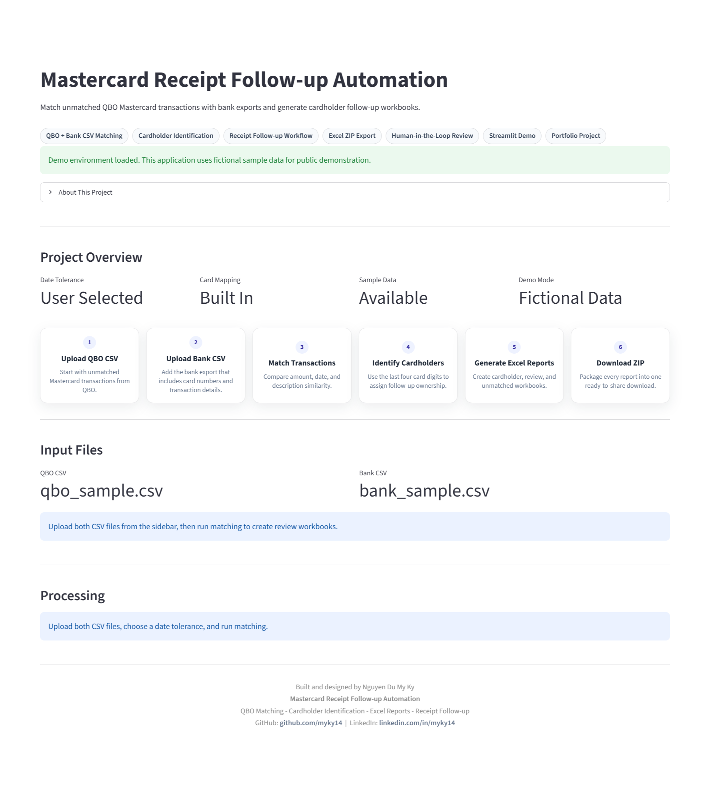
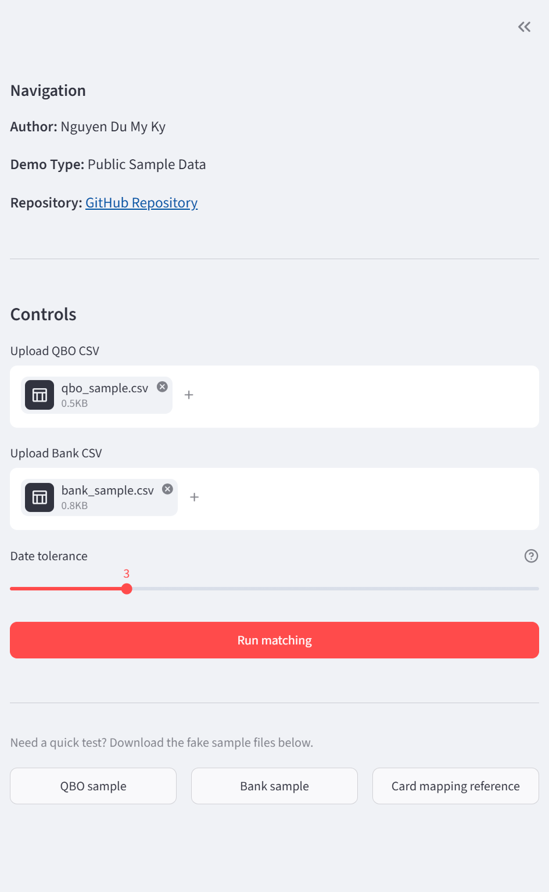
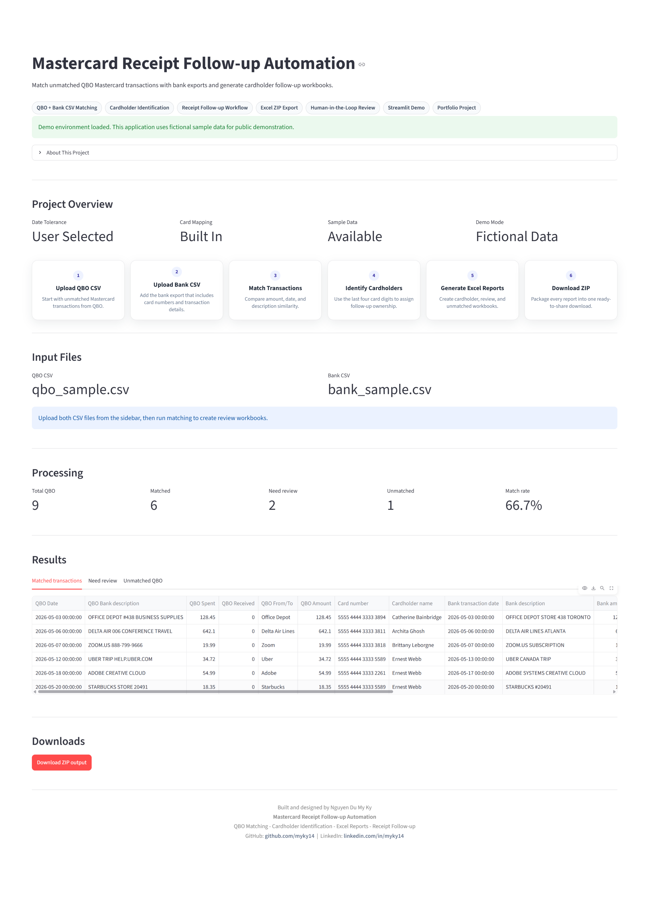

<div align="center">

# Mastercard Receipt Follow-up Automation


</div>

## Live Demo

🚀 Try the application here:

https://kynguyen-mastercard-receipt-followup-automation.streamlit.app/

## Table of Contents

- [Project Overview](#project-overview)
- [Why I Built This Project](#why-i-built-this-project)
- [Business Understanding](#business-understanding)
- [Solution Architecture](#solution-architecture)
- [Key Features](#key-features)
- [Matching Logic](#matching-logic)
- [Results](#results)
- [Portfolio Highlights](#portfolio-highlights)
- [Tech Stack](#tech-stack)
- [Skills Demonstrated](#skills-demonstrated)
- [Project Structure](#project-structure)
- [How to Run Locally](#how-to-run-locally)
- [Input File Requirements](#input-file-requirements)
- [Output Files](#output-files)
- [Screenshots](#screenshots)
- [Status](#status)
- [Data Privacy](#data-privacy)
- [Disclaimer](#disclaimer)

## Project Overview

This is a personal Python automation project for matching unmatched Mastercard transactions from QuickBooks Online with bank export data.

The project uses a Streamlit interface to upload CSV files, match transactions, identify the cardholder from the last four digits of the card number, and generate separate Excel files for receipt follow-up.

## Why I Built This Project

I work with accounting-related workflows, and one recurring task was figuring out which employee used a corporate Mastercard transaction when the receipt was still missing.

The process usually involved comparing a QuickBooks Online export against a separate bank export. QBO showed the unmatched transactions, while the bank file showed the card number used for each transaction. After identifying the cardholder, the transactions still had to be separated into individual Excel files so each person could be followed up with.

That manual workflow was repetitive, time-consuming, and easy to slow down when there were many transactions. I built this project to practice Python automation while solving a real accounting workflow problem that I understood from experience.

## Business Understanding

Before automation, the workflow looked like this:

- Export unmatched Mastercard transactions from QuickBooks Online.
- Export detailed Mastercard transactions from the bank.
- Compare transaction dates, amounts, and descriptions manually.
- Use the bank card number to identify the likely employee.
- Separate transactions by cardholder.
- Create individual Excel files for receipt follow-up.

The important detail is that QBO is the main list of transactions that need attention, while the bank export provides the card number needed to identify the cardholder.

## Solution Architecture

```text
QBO Export
    |
    v
Bank Export
    |
    v
Transaction Matching
    |
    v
Cardholder Identification
    |
    v
Excel Report Generation
    |
    v
ZIP Download
```

## Key Features

- Upload QBO and bank CSV files through Streamlit
- Adjust date tolerance for matching
- Clean column names with capitalization and spacing variations
- Normalize QBO and bank transaction amounts
- Match transactions using amount and date as the primary signals
- Identify cardholders using card number last four digits
- Preview matched, review, and unmatched transactions
- Download all Excel outputs as a ZIP file

## Matching Logic

- QBO `Tax` is ignored if present.
- QBO amount uses `Spent` first, then `Received` if needed.
- Bank amount is converted to an absolute value.
- Amounts must match within `0.01`.
- Dates must be within the selected tolerance, defaulting to `+/- 3 days`.
- RapidFuzz compares descriptions only when choosing between multiple amount/date candidates.
- Confirmed bank transactions are not reused for multiple QBO rows.

Confidence levels:

- `High`: amount/date match with one bank candidate
- `Medium`: amount/date match with multiple candidates where description similarity clearly identifies the best candidate
- `Review`: multiple candidates with no clear best candidate, unmapped card number, or another issue needing manual review
- `Unmatched`: no suitable bank transaction found

## Results

The current version supports:

- QBO transaction processing
- Bank transaction matching
- Cardholder identification
- Excel report generation
- Streamlit upload and preview workflow
- ZIP export workflow
- Review and unmatched transaction handling

## Portfolio Highlights

- Python automation for a repetitive accounting task
- Data cleaning with Pandas
- Excel automation with OpenPyXL
- Workflow design from real accounting process pain points
- Streamlit development for a simple interactive interface
- Practical accounting process improvement through automation

## Tech Stack

### Core Technologies

<div align="center">


</div>

This project combines Python automation, transaction matching, and Excel reporting to streamline a repetitive accounting workflow.

## Skills Demonstrated

This project demonstrates how Python can be used to automate repetitive accounting workflows by combining data cleaning, transaction matching, Excel reporting, and workflow design.

### Business Skills

<div align="center">


</div>

### Data Skills

<div align="center">


</div>

### Technical Skills

<div align="center">


</div>

## Project Structure

```text
mastercard-receipt-followup-automation/
|-- app.py
|-- requirements.txt
|-- README.md
|-- .gitignore
|-- src/
|   |-- __init__.py
|   |-- config.py
|   |-- cleaning.py
|   |-- matching.py
|   `-- exporter.py
|-- sample_data/
|   |-- qbo_sample.csv
|   |-- bank_sample.csv
|   `-- card_mapping.csv
|-- output/
`-- assets/
```

## How to Run Locally

Install dependencies:

```bash
pip install -r requirements.txt
```

Run the Streamlit app:

```bash
streamlit run app.py
```

Then open the local Streamlit URL in your browser.

## Input File Requirements

### QBO CSV

Required columns:

- `Date`
- `Bank description`
- `Spent`
- `Received`
- `From/To`

Notes:

- `Tax` is ignored if present.
- QBO is treated as the source list for transactions that need follow-up.

### Bank CSV

Required columns:

- `Transaction date`
- `Card number`
- `Description`
- `Amount`

Optional columns:

- `Date carried to statement`
- `Reference`
- `Status`

Cardholder mapping is stored in `src/config.py` and shown in `sample_data/card_mapping.csv`.

## Output Files

The ZIP download contains:

- `Catherine_Bainbridge.xlsx`
- `Archita_Ghosh.xlsx`
- `Brittany_Leborgne.xlsx`
- `Ernest_Webb.xlsx`
- `Need_Review.xlsx`
- `Unmatched_QBO.xlsx`

Each Excel file includes QBO details, bank match details, cardholder name, match confidence, and match notes.

## Screenshots







## Status

Current Status: MVP Version 1.0

Completed:

- Matching engine
- Streamlit UI
- Excel export
- ZIP generation
- Cardholder mapping

Planned:

- User-managed card mapping upload
- Matching audit log
- Deployment
- Enhanced matching rules

## Data Privacy

Real QuickBooks Online exports should never be committed to this repository.

Real bank exports should never be committed to this repository.

The `output/` folder should remain gitignored because generated reports may contain sensitive transaction details.

Only fictional sample data should be used in public versions of this project.

## Disclaimer

This is a personal portfolio project.

No real company data is included.

Any sample files are fictional.

This project is not affiliated with any employer or client.

---

<div align="center">

Built and designed by <b>Nguyen Du My Ky</b>

Mastercard Receipt Follow-up Automation

QBO Matching • Cardholder Identification • Excel Reporting • Receipt Follow-up

GitHub: https://github.com/myky14   |   LinkedIn: https://www.linkedin.com/in/myky14/

</div>
